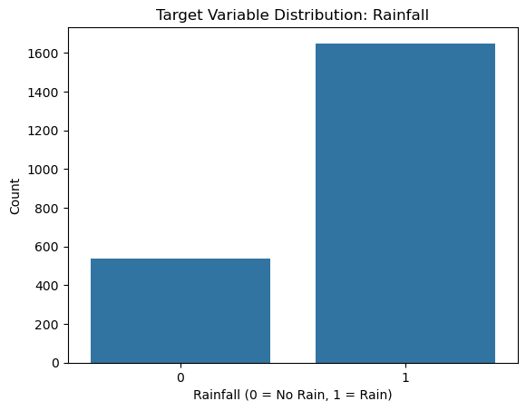
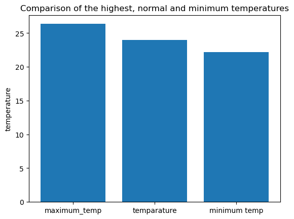
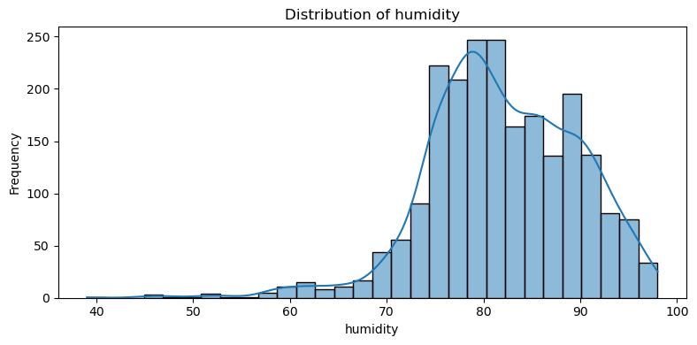
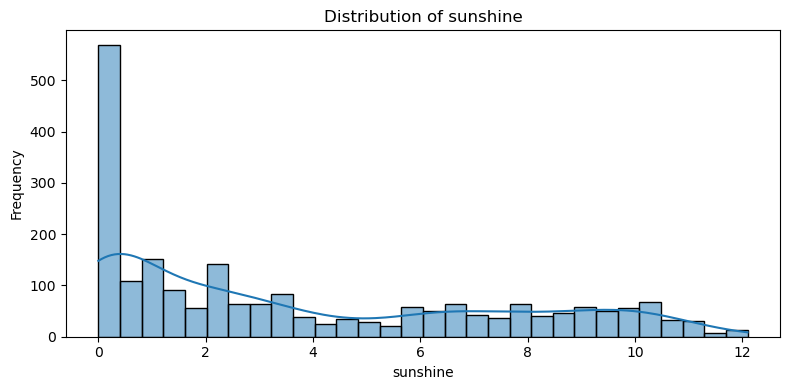
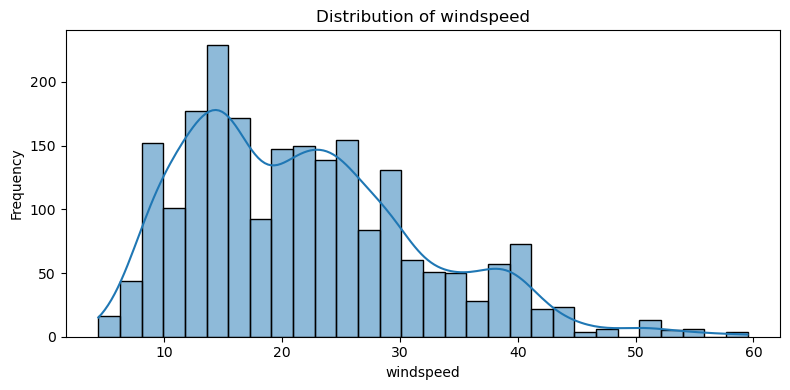
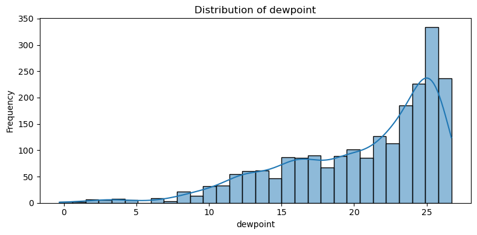
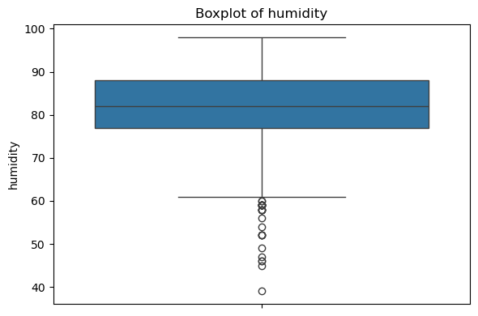
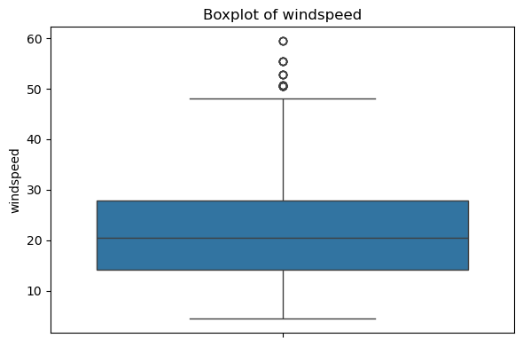

# PHASE_5_CAPSTONE_PROJECT
Group 2 Capstone Project for our Data Science program. This repo includes data preprocessing, EDA, feature engineering, machine learning modeling, and insights generation. It follows best practices in collaboration, version control, and reproducibility using Jupyter notebooks and Python.

# 📀 **Capstone Project: AI-Powered Rainfall Prediction for High-Impact Decision Making**

## 🌧️ Overview
Predicting rainfall isn't just a weather problem — it's a mission-critical challenge with implications across **agriculture**, **disaster preparedness**, **urban planning**, and **climate resilience**. This project leverages machine learning to accurately forecast rainfall, ensuring decision-makers act not just faster, but smarter.

---

## 🔍 Problem Statement
Forecasting rainfall using meteorological data is a complex classification problem. The aim is to predict whether it will rain (`1`) or not (`0`) based on key weather indicators such as temperature, humidity, pressure, cloud cover, and sunshine.

---

## 💾 Dataset Summary
- **Source**: Provided via Kaggle competition
- **Training Set**: 2,190 rows × 25 features
- **Test Set**: 1,464 rows (rainfall column to predict)
- **Target Variable**: `rainfall` (binary)

---

## 🔄 Step 1: Business Understanding
**💡 Why This Matters:**
- Farmers can plan irrigation efficiently
- Cities can prepare for flooding
- Energy sectors can optimize grid loads

> Rainfall prediction is not a luxury — it's a necessity in climate-vulnerable economies.

---

## 🧹 Step 2: Data Cleaning & EDA
### 📊 Highlights:
- ✅ No missing values in the training set
- ⚠️ 1 missing value in test set (handled during preprocessing)
- 🧭 Observed class imbalance (more rainy days)

### 📈 Visuals:
- [## 🌧️ Target Variable Distribution

This plot shows class imbalance between rainy and non-rainy observations in the training data.

 ] Target variable distribution plot
- [## 🌡️ Temperature Comparison: Max, Mean & Min

Understanding how average, maximum, and minimum temperatures differ across observations provides insight into thermal ranges influencing rainfall.

 ] Temperature bar chart (max, mean, min)
- [## 💨 Humidity vs Windspeed by Rainfall

This scatterplot explores the relationship between **humidity** and **windspeed**, color-coded by rainfall outcome. It reveals subtle patterns in how atmospheric moisture and wind dynamics correlate with precipitation events.

 ] Humidity vs windspeed by rainfall (scatterplot)
- [ ## 📊 Univariate Analysis: Feature Distributions & Outliers

To better understand the behavior of individual meteorological features, we performed both **distribution analysis** and **outlier detection** using histograms and boxplots.

The following variables were explored:
- **Humidity**
- **Sunshine**
- **Windspeed**
- **Dewpoint**

#### 🌡️ Histograms - Feature Distributions
These histograms show how each feature is distributed in the training dataset. This helps reveal skewness, modality, and general variability.

- 
- 
- 
- 

#### 📦 Boxplots - Outlier Detection
These boxplots reveal the spread and presence of potential outliers in the same features, helping inform future steps like **outlier capping** or **robust scaling**.

- 
- 
- 
- ] Feature distributions & boxplots (humidity, sunshine, windspeed, dewpoint)

### Key Insight:
> Features like **humidity**, **cloud cover**, and **sunshine** exhibit clear patterns across rainfall classes.

---

## 📊 Step 3: Feature Engineering
### 🧬 What We Created:
- `temp_diff`: Max - Min temperature
- `humidity_index`: Relative humidity measure
- `windspeed_category`: Binned windspeed into levels
- Polynomial & interaction terms (e.g., `sunshine × windspeed`)
- Cyclical features: `day_sin`, `day_cos`

### 🔧 Pipelines Used:
- Outlier capping
- Custom transformers
- Saved as: `feature_engineering_pipeline.pkl`

### Visuals:
- [ ] Enhanced correlation matrix
- [ ] Top interaction terms heatmap
- [ ] Pairwise relationships by rainfall 

### Insight:
> Strong multicollinearity handled by **dropping >70 redundant features**

---

## 🎯 Step 4: Feature Selection
Used **Mutual Information** to retain the most predictive features.

### 📈 MI Score Highlights:
- Top features: `cloud`, `sunshine`, `humidity`, `maxtemp × cloud`
- Removed features with MI < 0.02

### Visuals:
- [x] MI Score bar chart (sorted)

> Final feature set reduced to **15 variables**, improving model interpretability and speed.

---

## 🧼 Step 5: Preprocessing Pipeline
### 🔧 Actions:
- **Numeric features** scaled using `MinMaxScaler`
- **Categorical features** one-hot encoded
- Saved pipeline: `Preprocessing_pipeline.joblib`

### 💡 Why It Matters:
Ensures consistent transformations across training & test datasets — a foundational best practice in production ML.

---

## ✂️ Step 6: Train-Test Split
Split the dataset:
- 80% → `X_train`
- 20% → `X_test`
- `random_state=42` for reproducibility

> This separation ensures realistic validation and helps avoid data leakage.

---

## 🤖 Step 7: Model Training — Stacking Ensemble
### 🔗 Base Models:
- Random Forest
- XGBoost (tuned)
- LightGBM
- Gradient Boosting
- Support Vector Classifier (RBF Kernel)

### 🔍 Meta Model:
- Logistic Regression (final estimator)
- Cross-validated with `cv=5`

### Visuals:
- [x] Confusion matrix (validation)
- [x] Classification report

---

## 🎯 Step 8: Evaluation Metrics
- **Accuracy**: `0.8516`
- **ROC-AUC**: `0.8623`
- **Precision-Recall Curve**: AP = 0.92

### Visuals:
- [x] Precision-Recall Curve
- [x] Distribution of Predicted Probabilities

> The model performs particularly well on **class 1 (rain)** — crucial in real-world contexts.

---

## 🆚 Step 9: Model Comparison
| Model              | Accuracy | ROC-AUC |
|-------------------|----------|---------|
| Logistic Regression | 0.84     | 0.86    |
| Decision Tree      | 0.84     | 0.86    |
| Random Forest      | 0.86     | 0.86    |
| XGBoost            | 0.87     | 0.86    |
| LightGBM           | 0.85     | 0.84    |
| **Stacking Ensemble** | **0.85** | **0.86** |

### Visuals:
- [x] 6 confusion matrices for model comparison

> **Stacking Ensemble** matched or outperformed all baselines while maintaining generalizability.

---

## 🧪 Step 10: Final Test Prediction & Submission
### 🧬 Workflow:
- Applied saved feature engineering pipeline
- Filtered only selected features
- Transformed using preprocessing pipeline
- Predicted using `stack_model.predict_proba`
- Saved to `submission.csv`

### 📤 Submission Format:
| id | rainfall |
|----|----------|
| 1  | 0.8746   |
| 2  | 0.1294   |

---

## 🏁 Final Thoughts
✅ Built a **feature-rich, explainable ML system**
✅ Tackled real-world issues like imbalance, leakage & redundancy
✅ Delivered reliable, confidence-calibrated rainfall forecasts

> This model is deployable for early warning systems, agricultural planning tools, and infrastructure defense.

---

## 📚 Future Work
- Explore temporal models (LSTM, Time Series Cross-Validation)
- Incorporate satellite or geospatial data
- Hyperparameter tuning via Optuna or Bayesian optimization

---

## 👨‍🔬 Authors
**Group 2 Capstone Team**  
_Data Scientists | Weather Prediction Specialists_  
📍 Nairobi, Kenya  
🔗 ✉️ [https://github.com/Otim135/PHASE_5_CAPSTONE_PROJECT]

